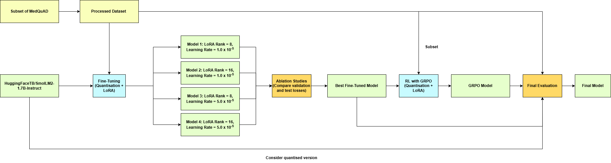

# MediLiteQA
## Introduction
In this study, we investigate ways to leverage small language models for healthcare question answering (QA). This is done as part of a project for DSA4213 (Natural Language Processing for Data Science).

We use a portion of the Medical Question Answering Dataset (MedQuAD), which can be found on [Kaggle](https://www.kaggle.com/datasets/jpmiller/layoutlm). A round of cleaning and processing was applied to this dataset. The final dataset can be accessed on [Kaggle](https://www.kaggle.com/datasets/bingxuanchia/dsa4213-medquad-processed-dataset) as well.

Our exploration comprises two main stages:
1. Fine-tuning `SmolLM2-1.7B-Instruct` models using various possible combinations of hyperparameters, so as to impart domain-specific knowledge pertaining to healthcare.
2. Applying reinforcement learning with Group Relative Policy Optimisation (GRPO) to the best-performing fine-tuned model, so as to improve readability of model responses.

## Project Workflow


## Setup Instructions
1. If you do not have Git installed, visit the [Git website](https://git-scm.com/downloads) for instructions on installation. Once installed, you can verify your version of Git by running the following in your terminal:

```
git --version
```

3. Clone the repository as follows:
```
git clone git@github.com:yjiahao/MediLiteQA.git
```

4. Set your working directory to the folder containing the cloned repository:
```
cd MediLiteQA
```

5. Create a Python virtual environment named `venv/`:

```
python -m venv venv
```

6. Activate the virtual environment:

```
venv\Scripts\activate
```

7. Install necessary packages:
```
pip install -r requirements.txt
```

## Data Exploration and Processing
1. Download the raw data from [Kaggle](https://www.kaggle.com/datasets/jpmiller/layoutlm). Save the CSV file at the path `./data/raw/medquad.csv`.

2. Run `data_exploration.ipynb` to conduct some exploratory data analysis (EDA) on the raw dataset.

3. Run `data_processing.ipynb` to process the raw dataset. After data cleaning is complete, the respective train, validation and test splits should be saved under `./data/processed/`, as 3 separate CSV files.

4. Run `grpo_split.ipynb` to obtain a subset of the training split, for the GRPO process. After this is complete, the GRPO training set should be saved at `./data/processed/grpo_train.csv`.

## Fine-Tuning
1. Upload `finetuning_instruct.ipynb` to Kaggle.
   
2. Under "Add-ons" > "Secrets", add your Hugging Face access token under the label `"HF_TOKEN"`. Your token should have "write" permissions.
   
3. Edit `TRACKIO_SPACE_ID` and `TRACKIO_PROJECT` to your liking. These values correspond to the run name and project name respectively, which are to be used in the Trackio dashboard produced.
   
4. Edit `HF_REPO_ID` to the Hugging Face repository that you wish to store the fine-tuned model in.
   
5. Edit the quantisation configurations (`BitsAndBytesConfig`), fine-tuning configurations (`SFTConfig`) and LoRA configurations (`LoraConfig`) to your liking.
   
6. Run the pipeline to fine-tune your chosen model. The training metrics will be tracked in a Trackio dashboard, which can be found at `https://huggingface.co/spaces/<TRACKIO_SPACE_ID>`. The resultant model will be saved at `https://huggingface.co/<HF_REPO_ID>`. The last cell evaluates the performance of the fine-tuned model on the testing set.

## GRPO Training

## Response Generation
1. Upload `response_generation.ipynb` to Kaggle.
   
2. Under "Add-ons" > "Secrets", add your Hugging Face access token under the label `"HF_TOKEN"`. Your token should have "write" permissions. 

3. Edit `final_model_names` to the names of the models that you wish to generate responses with.

4. Edit `HF_REPO_ID` to the Hugging Face repository that you wish to store the generated responses in.

5. Run the pipeline to carry out response generation on the testing set. The responses will be saved as a Hugging Face dataset, at `https://huggingface.co/datasets/<HF_REPO_ID>`.

## Final Evaluation
1. Upload `final_evaluation.ipynb` to Kaggle.
   
2. Under "Add-ons" > "Secrets", add your Hugging Face access token under the label `"HF_TOKEN"`. Your token should have "write" permissions.

3. Under "Add-ons" > "Secrets", add your Groq API keys. In the code, do also edit `groq_token_keys` so that it tallies with the labels to which the API keys are saved.

4. Edit `DATASET_PATH` so that it matches the Hugging Face repository which the generated responses are saved in.

5. In the last cell, edit `model_names` so that they reflect the column names of the dataset, corresponding to the names of the models that are to be evaluated.

6. Run the pipeline to evaluate the performance of the chosen models. Two metrics will be produced - the BLEU score and the LLM-as-a-judge score.

## External Links
The following is a series of relevant links for our project.
- [Cleaned MedQuAD dataset](https://www.kaggle.com/datasets/bingxuanchia/dsa4213-medquad-processed-dataset)
- [Fine-tuned model](https://huggingface.co/chiabingxuan/SmolLM2-1.7B-Instruct-MediLite-QA-Rank8-Quantized-LowLR) with LoRA rank = 8, learning rate = 1.0 $\times$ 10<sup>-5</sup>
- [Fine-tuned model](https://huggingface.co/Jiahao123/SmolLM2-1.7B-Instruct-MediLite-QA-Rank8-Quantized-HighLR) with LoRA rank = 8, learning rate = 5.0 $\times$ 10<sup>-5</sup>
- [Fine-tuned model](https://huggingface.co/Jiahao123/SmolLM2-1.7B-Instruct-MediLite-QA-Rank16-Quantized) with LoRA rank = 16, learning rate = 1.0 $\times$ 10<sup>-5</sup>
- [Fine-tuned model](https://huggingface.co/Jiahao123/SmolLM2-1.7B-Instruct-MediLite-QA-Rank16-Quantized-HighLR) with LoRA rank = 16, learning rate = 5.0 $\times$ 10<sup>-5</sup>
- [GRPO model](https://huggingface.co/Jiahao123/medilite-grpo-v1)
- [Hugging Face dataset containing model responses for final evaluation](https://huggingface.co/datasets/Cowboygarage/MediLite-QA-Response-Evaluation)
- [Trackio dashboard 1](https://huggingface.co/spaces/Jiahao123/MediLiteQA) (see `medilite-finetuning` and `medilite-grpo`)
- [Trackio dashboard 2](https://huggingface.co/spaces/chiabingxuan/MediLiteQA) (see `medilite-finetuning-v2`)